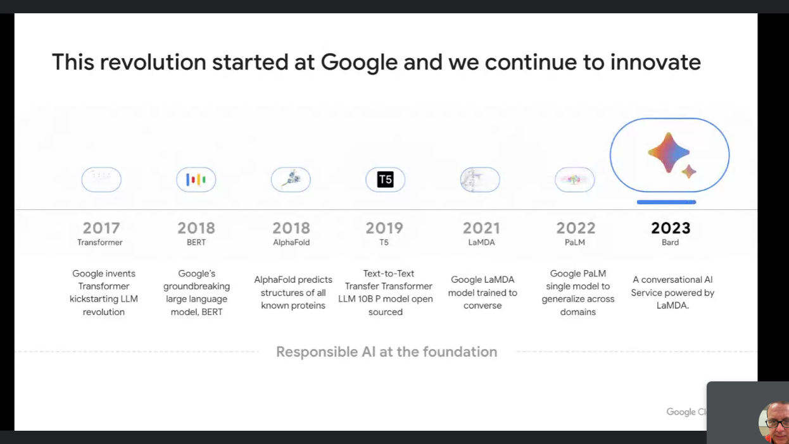
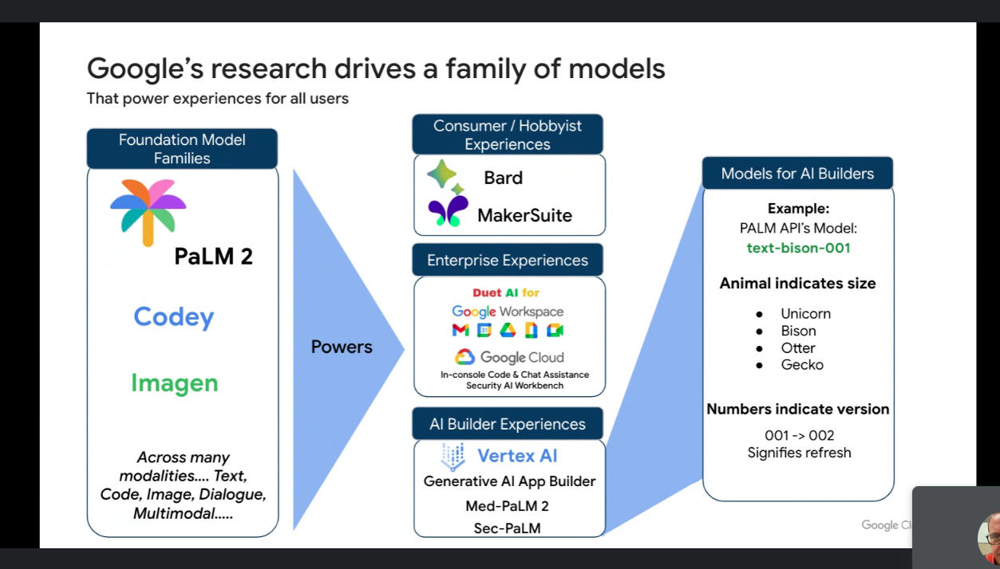
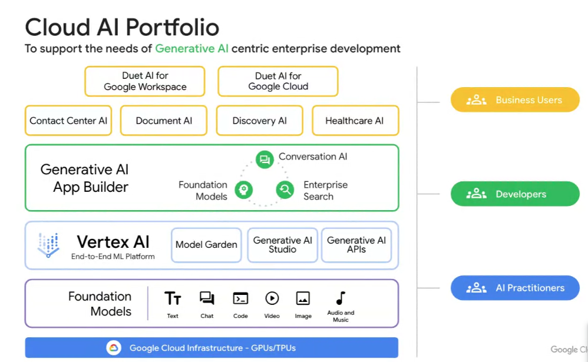
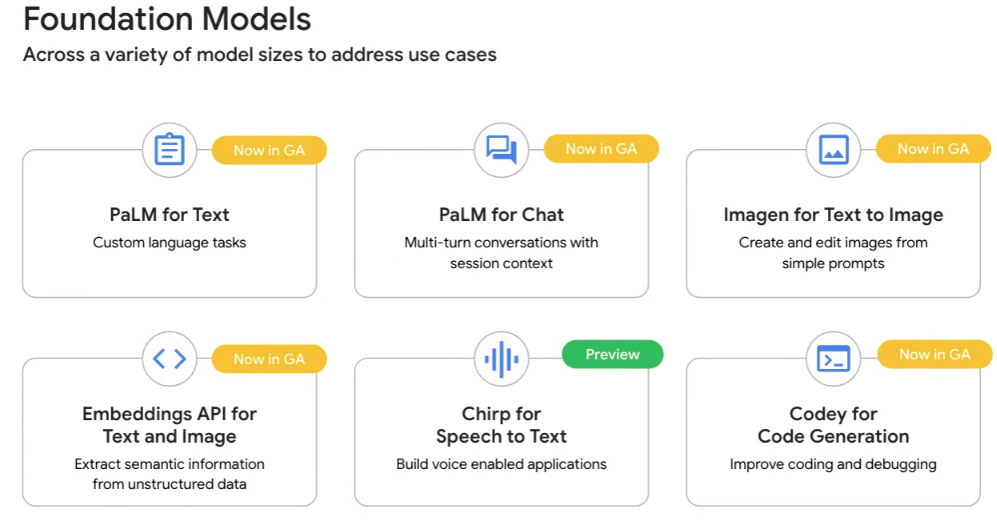

# GCP notes

## images 

## notes

Foundation models for text and code

* text-bison
    - chat model
    - trainable
    - tokens correspond to syllabels
* code-bison
    - code model
    - trainable
    - code genera
    - code fixingtion
    - code optimization
    - code translation
    - The duet vs code api uses a tuned code-bison model under the hood
    - tokens correspond to characters
* codechat-bison
    - code model
    - trainable
    - code generation
    - documentation in comments
    - release notes generation
    - code explanation
    - code fixing
    - code optimization
    - code translation
* code-gecko
    - code completion

Other models

    * duet
        - Duet is the equivalent of openAI's chapGPT where it is the chat
        client as opposed to gpt-turbo.  Need to understand if this is correct.
        - duet is a plugin for vs code
        - works to answer questions in gcp console
        - works in google drive apps

## URLS

* [Codey APIs](https://cloud.google.com/vertex-ai/docs/generative-ai/code/code-models-overview)
* [Generative AI Studio](https://cloud.google.com/vertex-ai/docs/generative-ai/learn/generative-ai-studio)
* [tuning a model](https://cloud.google.com/vertex-ai/docs/generative-ai/start/quickstarts/quickstart-tuning#generative-ai-tune-model-console)
* [tune a code model](https://cloud.google.com/vertex-ai/docs/generative-ai/models/tune-code-models)
* [duet](https://cloud.google.com/blog/products/application-development/introducing-duet-ai-for-developers)
* [duet video](https://www.youtube.com/watch?v=g5TwQx60NXs)
* [bc hero game](https://www.cloudskillsboost.google/games/4348)
* [duet ai for gcp](https://cloud.google.com/blog/products/application-modernization/introducing-duet-ai-for-google-cloud]

