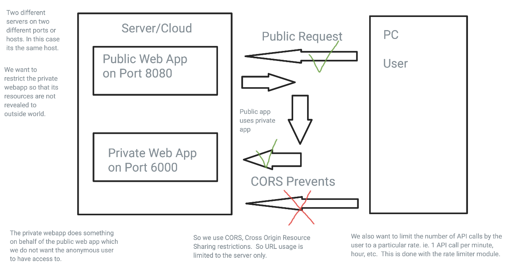

# router notes

This is a type-along to a youtube URL.  The youtube video URL is [below](#URLS).

It shows:

* how to hide API keys via NODE.js router module.
* How to use CORS to protect resources
* How to use the rate limiter module



## Setup


### versions

```
$ node -v
v19.7.0
$ npm -v
9.5.0
```

Update via

```
$ npm install -g npm@9.6.4
```


### Create the initial package.json

```
$ node init -y
```

If using this repo and the `package.json` is already created, do this instead

```
$ npm install
```

### Install the packages


Install four packages for production

* `dotenv` add support for `.env` files to contain environment variables
* `express` adds support webframeworks
* `cors` allows restrictions on domains to access routes
* [`node-fetch`](https://www.npmjs.com/package/node-fetch) provides a fetch API capability to node.
* `express-rate-limit` limits the number times per sec per ip on api requests

Afterwards the package.json has a dependencies section.

```
$ npm i dotenv express cors node-fetch
```

Install `nodemon` as a development dependecy for use during development.
It restarts the webserver everytime a file is saved.  This also updates
the package.json.  The update occurs in the `devDependencies` section.

```
$ npm i nodemod -D
```

Modify the `scripts` section of `package.json` so that it starts the app
and uses nodemon to restart the app everytime its saved during
development.

```
 "scripts": {
-    "test": "echo \"Error: no test specified\" && exit 1"
+    "start": "node index.js",
+    "dev": "nodemon index.js"
  },
```

## create the entry point

Create `index.js` in the directory with `package.json`

```
// pull in dotenv and call its `config()` method.
require("dotenv").config();
// pull in the express framework
const express = require("express");
// pull in cors
const cors = require("cors");

const app = express();
const port = 3000;

// enable the JSON middleware on every route for our api
app.use(express.json());

// Enable use of cors.  For now, do so without any options
app.use(cors());

// Create a test route with an anonymous function
app.get("/", (req, res) => res.json(
    { success: "Hello World"}
));

// Listen on the port and log to console using an anonymous
// function
app.listen(port, () => console.log("App listening on port ${port}"));
```

Run the dev script portion of the package.json via

```
$ npm run dev
```


## Create the weather api usage

This is a folder beneath the webapp which will be relayed to the
main app.

```
$ mkdir weather
$ touch weather/index.js
```

Add the following mods to `weather/index.js`

```
const express = require("express");
const router = express.Router();
const fetch = require("node-fetch");


// use of an anymous function to make a callback
router.get("/", (req, res) => {
    res.json({ success: "hello Weather!"});
});

// This creates a stub api of weather/ so that
// it can be connected in the parent app.
module.exports = router;
```

Add the following mods to `index.js` in the top directory

```
+ // add sub weather route
+ const weather = require("./weather");

+ // Provide the connection to the weather sub app as an api route
+ app.use("/weather", weather)
```

This broke and based upon the video comments, non-fetch v3 does support require.  The workaround
is to do:

```
$ npm remove node-fetch
$ npm install node-fetch@2
```

This will remove the v3 package and install the v2 package.  Afterwards, rerun

```
$ npm run dev
```

Test via appending `/weather` to the URL in the browser.

Create an account on openweathermap.org and get a key.  Put this key
in an `.env` file at the top of the repo - the same dir as the package.json
file.  Add `.env` to the .gitignore file so that it is not visible.

The `.env` file will look like this:

```
WEATHER_API_KEY=API_KEY_NOT_SHOWN
```

The `.gitignore` file at top-level already has the `.env` file ignored.


Add the following three routines:

* `fetchWeather()`
* `router.get("/:searchtext", async (req, res) ...)`
* `router.post("/", async (req, res) ...)`

Test via adding a city after the url. eg `/weather/durham`. It will return the weather json data for the 
city of Durham.


For postman and post request, add header `content-type` with value `application/json`, for body, click raw and then type `{"searchtest":"Durham"}`.


Add node package, `express-rate-limit`.

```
$ npm i express-rate-limit
```


## URLS

* [reference youtube video](https://www.youtube.com/watch?v=uk9pviyvrtg)

