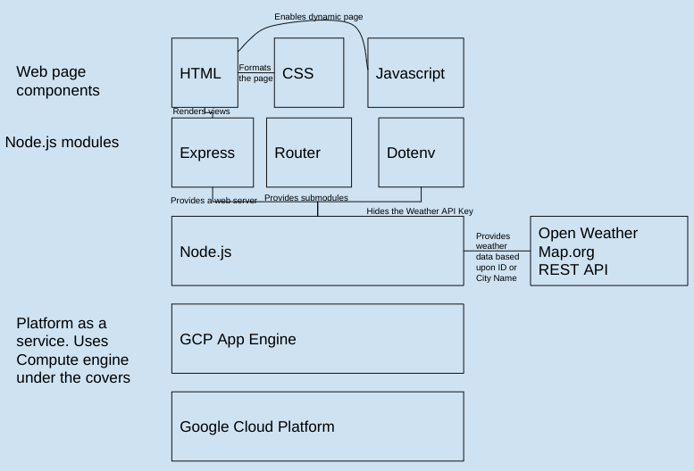

# router2 app engine stub

This shows:

* How to create a simple NODE.js app
* How to deploy it on GCP as an App Engine microservice
* How to use a webapp api and not reveal the key




## NODE.js Notes

### install packages

```
$ npm install .
```

#### install dev package nodemon
```
$ npm i nodemod -D
```

Modify the `scripts` section of `package.json` so that it starts the app
and uses nodemon to restart the app everytime its saved during
development.

```
 "scripts": {
-    "test": "echo \"Error: no test specified\" && exit 1"
+    "start": "node publicapp.js",
+    "dev": "nodemon publicapp.js"
  },
```

### starting locally

```
$ npm start
```

#### starting developer mode

Run the dev script portion of the package.json via

```
$ npm run dev
```


### Test with urls of this form


Durham by ID
```
https://somehostedurl/myrouter/ByID/4464368
```

Wichita by Name
```
https://somehostedurl/myrouter/ByName/Wichita
```

## GCP App Engine Specifics


### URLS
https://cloud.google.com/appengine/docs/standard/nodejs/building-app/creating-project

1. Create project
2. $ gcloud init
2. Enable cloud build api.

### if you can't the default app engine service

Go to settings in app engine and disable the default service.

Nevermind, you can't delete the default service.  You have to delete the entire project.
See [here](https://stackoverflow.com/a/49388143/1008596)


### Setup for gcloud

Make sure you run `gcloud info` to see the
project settings are correct.

```
$ gcloud info
```

Make sure you install required packages before the deploy.

```
$ npm install .
```


### starting on app engine

In the package.json have a section like this

```
"scripts": {
  "start": "node app.js"
}
```

### deploying the webapp to app engine

In order to have two app engine services in the same project, edit the `app.yaml` file to specify a new service.
See [here](https://cloud.google.com/appengine/docs/standard/reference/app-yaml?tab=node.js#top)

```
untime: nodejs16
service: router2
```

In the directory containing the app.yaml and package.json do:

```
$ gcloud app deploy
```

Likewise to view the app in your browser.  Note, you need to specify the service otherwise it will
show the default service.

```
$ gcloud app browse --service=router2
```

## Firebase notes

### Setup

install firebase package using npm

```
$ npm install firebase
```

We created a firebase app using the firebase console and specified the
gcp project that has our app engine webapp.


## Testing

```
$ npm run dev
```

### Web Server Public URLs

| URL                           | app      | Notes                              |
|-------------------------------|----------|------------------------------------|
|  http:/server.com/            |  public  | renders view/index.js              |
|  http:/server.com/index.js    |  public  | renders view/index.js              |
|  http:/server.com/about.js    |  public  | renders view/about.js              |
|  http:/server.com/doit.js     |  public  | renders view/doit.js              |

### Web Server API Private/Router URLs

For now, these are not private.  Its also just a single app. 

| URL                                 | app      | Notes                              |
|-------------------------------------|----------|------------------------------------|
|  http:/server.com/router            | private  | public uses router /               |
|  http:/server.com/router/nnnn       | private  | public uses router /nnn            |
|  http:/server.com/router/ByID/nnn   | private  | public uses router /ByID/nnn       |
|  http:/server.com/router/ByName/xxx | private  | public uses router /ByName/xxx     |


### Errors

Use `rs` to restart `npm run dev`.


### URLS

* [reference for express](https://expressjs.com/en/starter/static-files.html)

